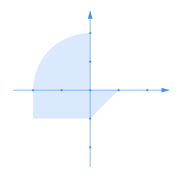

# Лабораторная работа №4

Измененное приложение из [предыдущей лабораторной работы](https://github.com/killreal777/web-lab3)

Приложение, осуществляющее проверку попадания точки в заданную область на координатной плоскости

В приложении реальзованы регистрация и авторизация пользователей, доступ к основному API есть только у авторизованных пользователей

- Backend реальзован на __Spring__
- Результаты проверки попаданий сохраняются в базе данных под управлением СУБД __PostgreSQL__
- Для доступа к БД используется __Spring Data__
- Для авторизации пользователей используется __Spring Security__

## API

### Регистрация и авторизация

- __POST /api/auth/login__ - авторизовать пользователя

    Модель тела запроса: User

- __POST /api/auth/register__ - зарегистрировать пользователья

    Модель тела запроса: User

### Основной API

- __GET /api/hitChecks__ - получить список всех проверок

    Модель тела ответа: HitCheck[]

- __POST /api/hitChecks__ - проверить попадание точки в область
    
    Модель тела запроса: AreaDot

- __DELETE /api/hitChecks__ - удалить данные о всех проверках

### Модели DTO

- __User__ - данные о пользователе
    ```
    username: string
    password: string
    ```

- __AreaDot__ - данные о координатах точки и радиусе
    ```
    r: number
    x: number
    y: number
    ```

- __HitCheck__ - данные о результате проверки попадания
    ```
    startTime: string
    executionTime: integer
    areaDot: AreaDot
    hit: boolean
    ```


## Координатная плокость и область

Параметр R соответствует расстоянию между центром координат и дальними от него точками (радиус четверти круга)



#### Диапазоны изменения данных

- X: (-3; 5)

- Y: (-4; 4)

- R: {1, 2, 3, 4 5}

